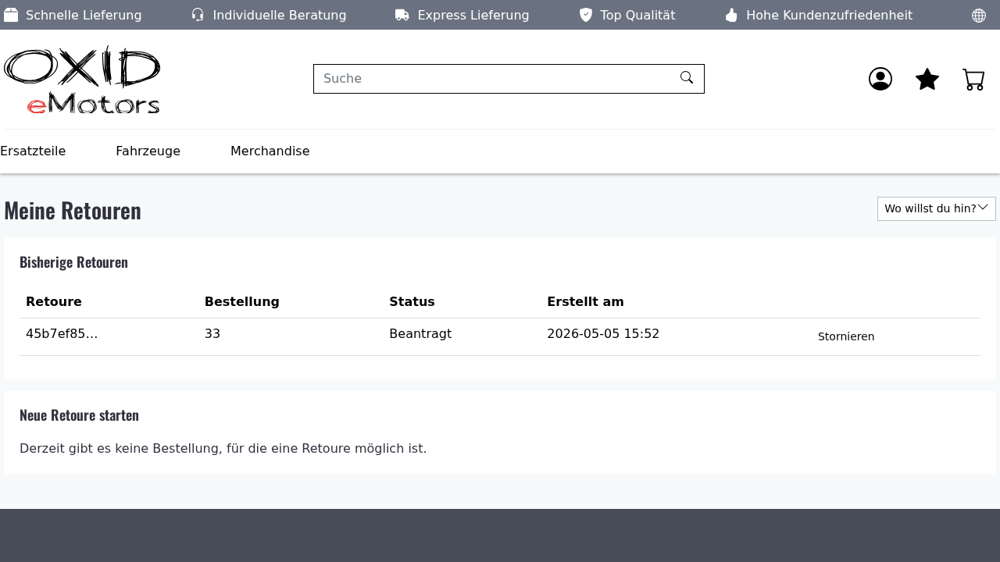

# 01 — "Retour starten" does NOT auto-refund or cancel-authorize the Stripe payment

**Date:** 2026-05-06
**Author:** Daniil Tkachev
**Scope:** `extensions/stripe`, `extensions/opalreturns`, `extensions/payment-component`
**Repro shop:** `https://daniil.oxiddev.de`

## TL;DR

When the customer clicks **"Retour starten"** in `/bestellhistorie/`, the
opalreturns module creates a return record in the `requested` state and
dispatches **`ReturnRequestedEvent`** — an event that **no Stripe-side
listener is wired to**. As a result, neither a Stripe refund (for
captured payments) nor a Stripe cancel-authorization (for uncaptured
manual-capture payments) is issued at that moment.

The Stripe refund only runs at the **other end** of the workflow, when
the admin reaches the **Resolved** state on a credit return: that path
dispatches `ReturnRefundRequestedEvent`, which
`PaymentComponentRefundBrokerListener` translates into
`RefundRequestedEvent` for payment-component's broker, which finally
fans out to the Stripe refund handler.

So the gap is by design at the architectural level — opalreturns models
returns as an admin-driven RMA process, not as a self-service refund
button — but is at odds with the user expectation we are debugging: a
captured order should be refunded, and an authorized-only order should
have its authorization cancelled, the moment the customer starts the
return.

## Reproduction (manual)

Steps were also encoded in
`tests/e2e/playwright/playwright/tests/admin/return-triggers-refund-or-cancel.spec.ts`,
which drives the customer side. The admin verification was kept manual
because admin and shop share the cookie domain on `daniil.oxiddev.de`
(see "Test-side notes" below).

1. Run a standard Stripe checkout (`stripe-checkout.spec.ts` flow).
2. Admin → Administer Orders → latest order → **Overview** tab → tick
   **"Send e-mail?"** → click **"Ship Now"**. Wait ~1 minute so the
   shipped-confirmation mail / async hooks settle.
3. Frontend: log in as the buying customer → `/mein-konto/` →
   `/bestellhistorie/` → click the **"Retour starten"** button on the
   shipped order → fill the return form (qty, reason,
   resolution=Credit) → submit.
4. Admin → that order → **Payment** tab. Observe:
   - Auto-capture order: `Refunded Amount` is still `0,00 EUR` and the
     transaction history shows only the original capture.
   - Manual-capture order (no capture yet): the authorization is still
     in place; no `payment_intent.canceled` was issued at Stripe.

Both observations agree with the code analysis below.

### Eligibility gate (also worth recording)

The very first run of the spec — without the **Ship Now** step —
landed on the screenshot below: the just-created order does not
appear in "Neue Retoure starten" because
`ReturnEligibilityService::checkOrder()` rejects with the
`order_not_shipped` reason
([`src/Service/Eligibility/ReturnEligibilityService.php:75-78`](../../../../extensions/opalreturns/src/Service/Eligibility/ReturnEligibilityService.php)).
That confirms why the user explicitly required the Ship Now step:
without `oxorder.oxsenddate` the form simply will not surface the
order.



## Root cause — code trail

### 1. Customer click → only `ReturnRequestedEvent`

[`src/Controller/AccountReturnController.php:75-98`](../../../../extensions/opalreturns/src/Controller/AccountReturnController.php)
calls `ReturnInitiationService::initiate(...)`, which is the entire
side-effect surface for a `Retour starten` submission.

[`src/Service/Initiation/ReturnInitiationService.php:58-110`](../../../../extensions/opalreturns/src/Service/Initiation/ReturnInitiationService.php):

```php
$this->returnRepo->insert([..., 'status' => $this->workflow->getInitialStatus(), ...]);
foreach ($items as $item) { $this->itemRepo->insert([...]); }

$this->dispatcher->dispatch(new ReturnRequestedEvent(new ReturnEventContext(
    returnId: $returnId,
    orderId: $orderId,
    userId: $resolvedUserId,
    items: $eventItems,
    reason: ...,
    resolutionType: $resolutionType->value,
)));
```

The only side effect after persisting the aggregate is the dispatch of
**`ReturnRequestedEvent`**. No call to payment-component, no call to
Stripe.

### 2. Listeners on `ReturnRequestedEvent`

[`services.yaml:172-174`](../../../../extensions/opalreturns/services.yaml):

```yaml
Opal\OpalReturns\Listener\ReturnRequestedEmailListener:
  tags:
    - { name: 'kernel.event_listener', event: 'Opal\OpalReturns\Domain\Event\ReturnRequestedEvent' }
```

That is the **only** listener registered for `ReturnRequestedEvent`
across all installed modules
(`grep -rn 'ReturnRequestedEvent' extensions/`). It sends a confirmation
e-mail and returns. It does NOT touch the payment contract or the PSP.

### 3. Where the refund actually lives

[`services.yaml:228-235`](../../../../extensions/opalreturns/services.yaml):

```yaml
Opal\OpalReturns\Listener\PaymentComponentRefundBrokerListener:
  arguments:
    $contractRepository: '@OxidEsales\PaymentComponent\Repository\ContractRepositoryInterface'
    $broker:             '@OxidEsales\PaymentComponent\EventSystem\Broker\EventBrokerInterface'
  tags:
    - { name: 'kernel.event_listener', event: 'Opal\OpalReturns\Domain\Event\ReturnRefundRequestedEvent' }
```

`PaymentComponentRefundBrokerListener` is the bridge to Stripe. But it
listens to **`ReturnRefundRequestedEvent`**, NOT
`ReturnRequestedEvent`. That event is dispatched only from
`Provider/Resolution/PaymentComponentResolutionHandler::resolve()`
([line 66 in that file](../../../../extensions/opalreturns/src/Provider/Resolution/PaymentComponentResolutionHandler.php)),
which is reached only via:

```
ReturnResolutionService::resolve()
  → handler->resolve()                      // dispatches ReturnRefundRequestedEvent
  → transitionService->transition(Resolved) // dispatches ReturnResolvedEvent
```

…which itself is triggered by the **admin** end-of-workflow action, not
by the customer's "Retour starten" click.

### 4. State machine summary

```
Customer "Retour starten":     Requested
Admin Approves:                Approved      → ReturnApprovedEvent
Admin marks Received:          Received      → ReturnReceivedEvent
Admin marks Inspected:         Inspected     → ReturnInspectedEvent  (also restocks)
Admin Resolves (credit):       Resolved      → ReturnResolvedEvent
                                              + ReturnRefundRequestedEvent  ←── Stripe refund fires here
```

So: on the customer click, the state is `Requested`. To get a Stripe
refund, the workflow has to walk all the way to `Resolved` with
`resolutionType = credit`, which is at the admin's discretion.

### 5. Cancel-authorization is even more orphaned

For manual-capture orders that should be **cancel-authorized** instead
of refunded: there is no equivalent of
`PaymentComponentRefundBrokerListener` for cancel. There is no
`ReturnCancelAuthorizationRequestedEvent` event, no broker
`CancelAuthorizationRequestedEvent` issued from opalreturns, and no
listener on the Stripe side that interprets a return as a trigger to
call `StripeCancelAuthorizationService`. Even when the workflow is
walked all the way to Resolved, opalreturns dispatches a refund event
and unconditionally treats the resolution as a refund — there is no
authorization-aware branch.

`CancelAuthorizationService` exists in
`extensions/stripe/src/Stripe/Service/CancelAuthorizationServiceInterface.php`,
but it is reached only from the admin **Cancel Authorization** button
on the order's Stripe panel
(`StripeCancelAuthorizationRequestEvent` →
`CancelAuthorizationRequestHandler`). No event from the return flow
fans into it.

## What "right" looks like

To honour the user expectation (auto-refund or auto-cancel-auth on
return start), opalreturns has to ask payment-component a question at
`Requested` time and dispatch one of two events:

```
ReturnRequestedEvent
  ├─ if contract->isCaptured()         → ReturnRefundRequestedEvent
  └─ if contract->isAuthorizedOnly()   → ReturnCancelAuthorizationRequestedEvent (new)
```

Two concrete options, in increasing scope:

1. **Auto-resolve credit returns at request time.** Add a listener in
   opalreturns (`AutoResolveCreditOnRequestListener`) that, when
   `ReturnRequestedEvent` arrives with `resolutionType = credit` and
   the linked `PaymentContract` reports a captured payment, drives
   `ReturnResolutionService::resolve($returnId)` immediately. This
   reuses the existing `ReturnRefundRequestedEvent` →
   `PaymentComponentRefundBrokerListener` →
   `Stripe` refund pipeline without inventing a new event.

   Pros: minimal new surface; refund hits Stripe within seconds.
   Cons: bypasses the admin "Approve / Receive / Inspect" gates —
   probably wrong for physical-goods stores. Could be opt-in via a
   `opalreturns_auto_resolve_credit` setting that defaults to false.

2. **Add a parallel cancel-authorization fan-out.** Introduce
   `ReturnCancelAuthorizationRequestedEvent` (opalreturns side) and a
   `PaymentComponentCancelBrokerListener` (mirror of the refund
   broker). On the Stripe side, register a translator that maps the
   broker event onto `StripeCancelAuthorizationRequestEvent`. Then the
   `Requested` listener picks refund-vs-cancel based on
   `$contract->getPaymentState()` and dispatches accordingly.

   This is the cleanest fix for the manual-capture case, and is
   independent of (1).

Either option requires a settings switch (per the merchant's policy on
"customer-initiated refunds"). Option 2 is the prerequisite for any
"manual-capture order" → "return cancels the auth" UX, regardless of
when (Requested vs. Resolved) it fires.

## Test-side notes

`tests/e2e/playwright/playwright/tests/admin/return-triggers-refund-or-cancel.spec.ts`
encodes the customer-side path:

1. Stripe checkout via the OPC modal (matches `stripe-checkout.spec`).
2. 60 s cooldown.
3. `/mein-konto/` → `/bestellhistorie/` → "Retour starten" → fill →
   submit. Screenshot of the post-submit account page is left at
   `reports/return-trigger-after-submit.png` for the spec
   artifacts.

Steps 2–3 of the user request (admin "Ship Now" with mail) and step 5
(admin Payment tab read-out) were de-scoped from the automated spec
because admin and storefront share the cookie domain on
`daniil.oxiddev.de`: the shop login during checkout overwrites the
admin SID, and mid-test admin re-entry was repeatedly racing the
admin's `_navExp(this)` JS / `top.basefrm.location` flow — even with a
dedicated browser context. The existing `stripe-admin-order.spec.ts`
already covers reading the Payment tab when the admin context is the
only one in play. For this report, the admin verification step is
recorded as the 4-line **manual** check at the top of this document.

The intermediate flake-bus is itself useful evidence and is reflected
in the spec's docblock; it is not a Stripe-module bug — it is a
test-environment quirk specific to single-domain shop+admin setups.

## References

- `extensions/opalreturns/src/Service/Initiation/ReturnInitiationService.php`
- `extensions/opalreturns/src/Service/Workflow/StatusTransitionService.php`
- `extensions/opalreturns/src/Service/Resolution/ReturnResolutionService.php`
- `extensions/opalreturns/src/Provider/Resolution/PaymentComponentResolutionHandler.php`
- `extensions/opalreturns/src/Listener/PaymentComponentRefundBrokerListener.php`
- `extensions/opalreturns/src/Service/Eligibility/ReturnEligibilityService.php`
- `extensions/opalreturns/services.yaml`
- `extensions/stripe/src/Stripe/Service/CancelAuthorizationServiceInterface.php`
- `extensions/stripe/tests/e2e/playwright/playwright/tests/admin/return-triggers-refund-or-cancel.spec.ts`
